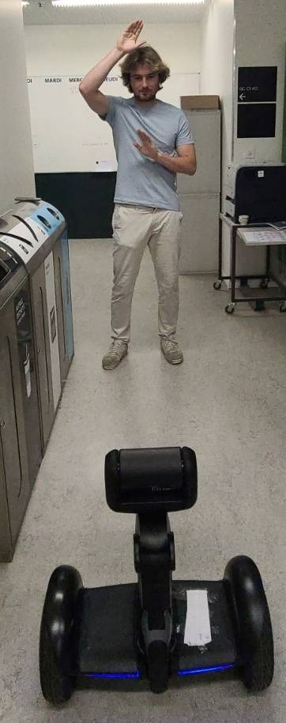

# CS-459 EPFL Deep learning for autonomous vehicles: Final Project 
Group 4: Nada Guerraoui, Thomas Peeters, Xinling Li, Kuan Lon Vu

This is the repository for the final project of CS-459. The goal of this project is to train a detector and tracker which will be exported to run on a Loomo robot at the EPFL Tandem Race 2022. For the model, we decided to use YOLOv5 deepsort as our selected model for the race.

## Repository Structure
This repository contains:
```
DLAV_group4
│   0001.jpg
│   README.md
│   client.py
│   detect_tracking.ipynb
│   detector.py
│   main.py
│   requirements.txt
│   run_client.sh
│   saved_model.pth
│   setup.py
│   test.py
│
└───yolov5-deepsort 
    
```
### YOLOv5 + deepsort files
*These files are used in milestones 2 and 3.*

`yolov5-deepsort`: This folder contains all the code for YOLOv5 for detection (since DeepSORT runs detection at every frame) and DeepSORT for tracking, cloned from [theAIGuysCode](https://github.com/theAIGuysCode/yolov4-deepsort). We are including the YOLOv5 weights (`yolov5s.pt`) in the folder.

### Milestone 1: detection

### Milestone 2: tracking
`detector_tracking.ipynb`: Yolov5  

### Milestone 3: Tandom Race

`client.py`: This file communicates between `detector.py` and the V100's server.

`detector.py`: Our tracker implemented in this file to be compatible with `client.py`.

`main.py`: `detect_tracking.ipynb` into a `.py` file.


## Instructions to run the code
*Note: Please connect to the EPFL network before proceeding*

### Milestones 1 and 2
Click on the provided Google Colab links for respective milestons and run all cells. Please ensure that the machine running the code is connect to the webcam.

### Milestone 3

#### Requirements
To install the required packages, run:

`pip install -r requirements.txt`

#### Connect to the V100 server
Run:

`ssh -AY group4@128.178.240.162` (Enter password when prompted)

`source venv/bin/activate`

#### Connect to the Loomo
*Note: Please turn on the Loomo, find its dynamic IP address and start the robot app on it before proceeding*
Run:

`adb connect <Loomo IP address>`

#### Run tracker on the Loomo
Run:

`python client.py --ip-address <Loomo IP address>`

### Initialise the tracker
Stand in front of the camera, do the following pose. Please hold the pose until initialisation is complete.




## References
- theAIGuysCode (2022). yolov4-deepsort. https://github.com/theAIGuysCode/yolov4-deepsort
